# Velonixs Connect - Architecture and UML Diagrams

**Version:** 1.1  
**Product:** Velonixs Connect  
**Owner:** Velonixs Technologies  
**Purpose:** Current implementation reference plus explicitly identified target architecture.

---

## 1. Document Scope

This document separates implemented architecture from planned architecture.

- **Current:** present in the repository and database.
- **Compatibility:** retained restaurant/menu naming that supports existing data and clients.
- **Planned:** proposed future capability; not currently implemented.

The current browser applications are server-rendered ASP.NET Core Razor applications. They use cookie authentication and call application services and EF Core directly. They do not currently call the REST API for their dashboards.

---

## 2. Current High-Level Architecture

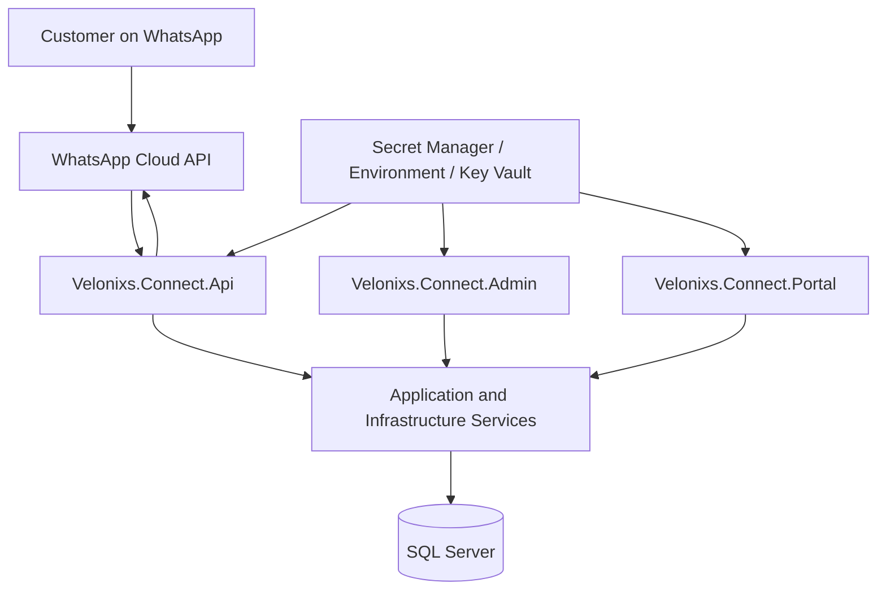

The API, Admin, and Portal are separate executable applications, but all three currently use the same persistence and service layers.

---

## 3. Current Application Architecture

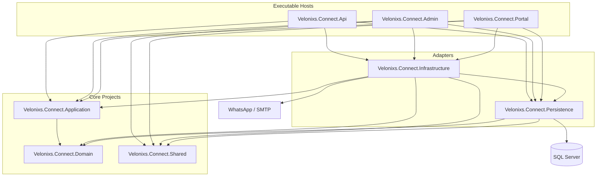

`Velonixs.Connect.Application` contains service contracts and DTOs. Most current service implementations live in `Velonixs.Connect.Infrastructure`.

---

## 4. Current Deployment Architecture

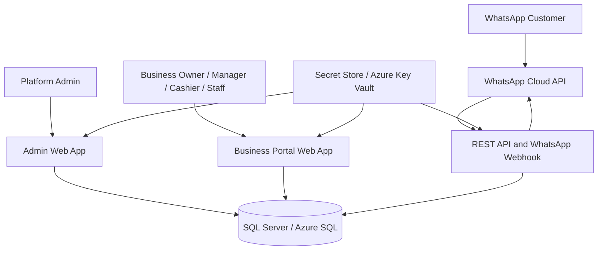

Azure Blob Storage, Application Insights integration, and API-only browser clients are planned, not current dependencies.

---

## 5. Browser Authentication Flow

Admin and Portal use ASP.NET Core cookie authentication.

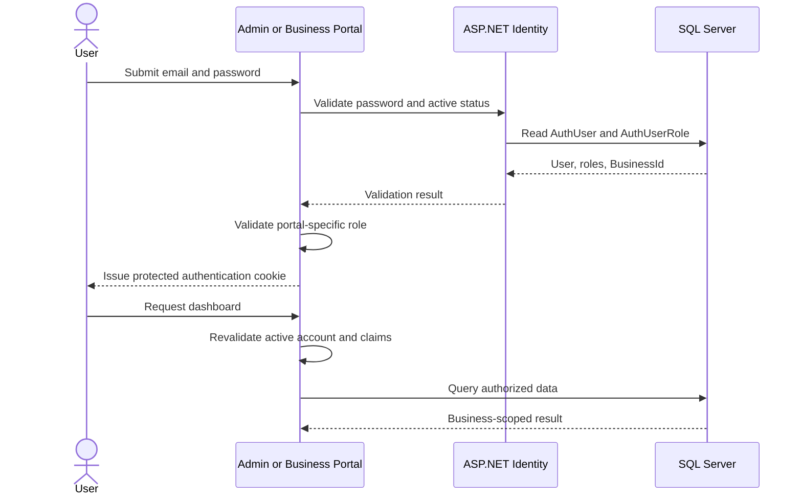

- Admin Portal requires `PlatformAdmin`.
- Business Portal requires an active user with a `BusinessId`.
- Disabled accounts are rejected even when an older cookie still exists.

---

## 6. API Authentication and Tenant Authorization

API clients use JWT bearer tokens from `POST /api/auth/login`.

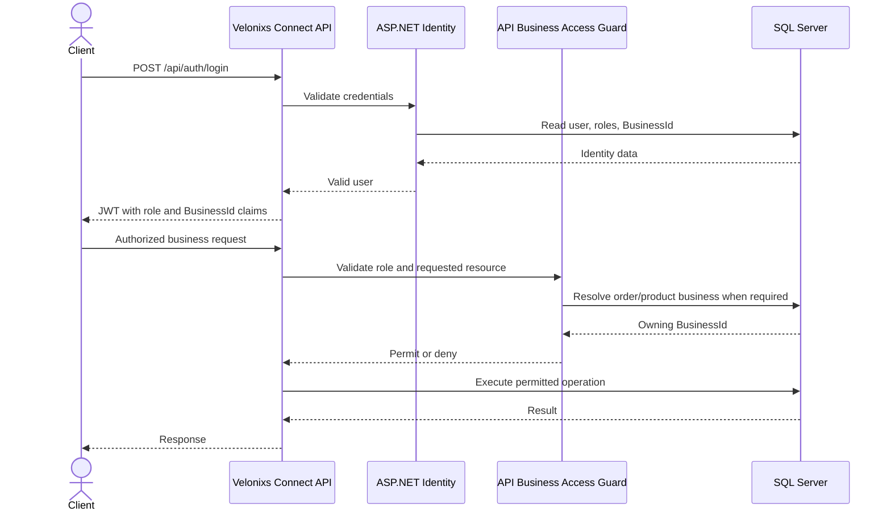

### Authorization Rules

- `PlatformAdmin` can access every business and create or update businesses.
- Owners and managers can read full configuration only for their assigned business.
- Cashier and staff accounts are limited to their business catalog and orders.
- Owners and managers can modify catalog availability and products.
- Owner, manager, cashier, and staff roles can access orders for their business.
- Modern business/catalog routes and compatibility restaurant/menu routes use the same tenant guard.
- WhatsApp webhook verification and delivery remain anonymous because Meta calls them.
- `/api/webhooks/whatsapp/local-test` is available only in Development.

---

## 7. Multi-Tenant Request Rule

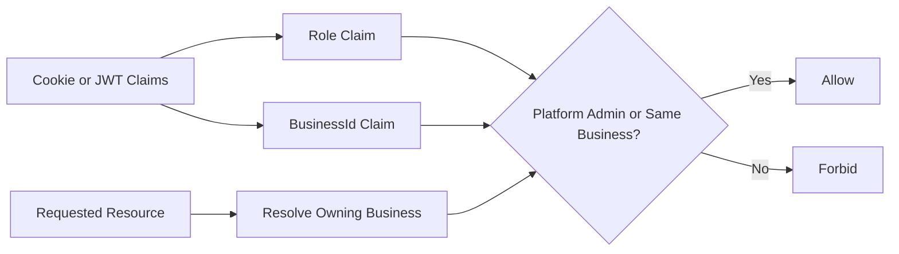

Business Portal queries also filter by the authenticated `BusinessId` before data is presented.

---

## 8. User Provisioning Flow

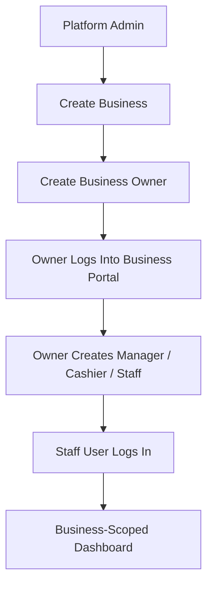

Only `BusinessOwner` currently manages staff users. Manager-based staff administration is not implemented.

---

## 9. WhatsApp Message and Order Flow

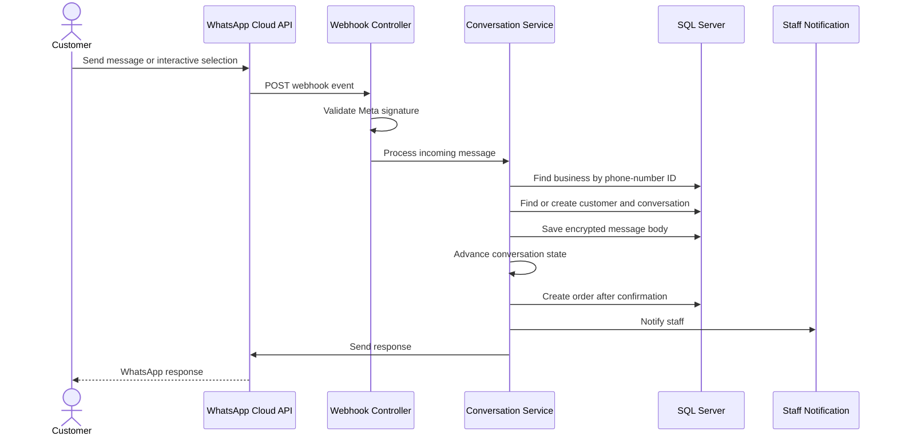

The business is currently found through the compatibility `Restaurant.WhatsAppPhoneNumberId` field.

---

## 10. Current Order Lifecycle

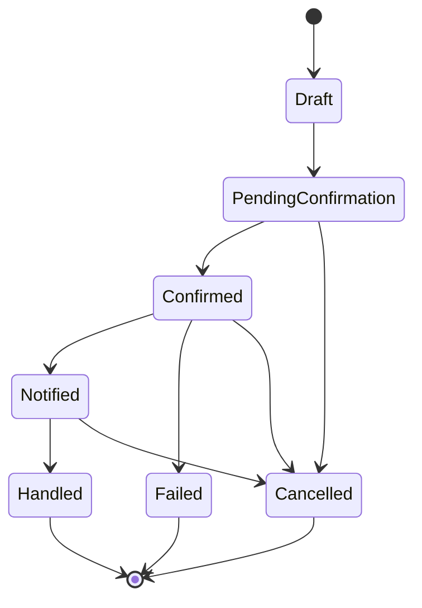

Preparing, Ready, Delivered, and customer-facing status notifications are planned workflow enhancements.

---

## 11. Current Role-Based Access Matrix

| Feature | PlatformAdmin | BusinessOwner | BusinessManager | Cashier | Staff |
|---|---:|---:|---:|---:|---:|
| Admin Portal | Yes | No | No | No | No |
| View all businesses | Yes | No | No | No | No |
| Create business and owner | Yes | No | No | No | No |
| Business dashboard | No | Yes | Yes | Yes | Yes |
| View business orders | Yes through API/Admin | Yes | Yes | Yes | Yes |
| Update order status | Yes through API/Admin | Yes | Yes | Yes | Yes |
| View catalog and customers | Yes | Yes | Yes | Yes | Yes |
| Change catalog availability | Yes through API/Admin | Yes | Yes | No | No |
| Create manager/cashier/staff | No | Yes | No | No | No |
| Enable or disable staff | No | Yes | No | No | No |

Billing, support, kitchen, viewer, and subscription-management roles are planned.

---

## 12. Current Physical Domain Model

The code and database retain restaurant/menu names for compatibility.

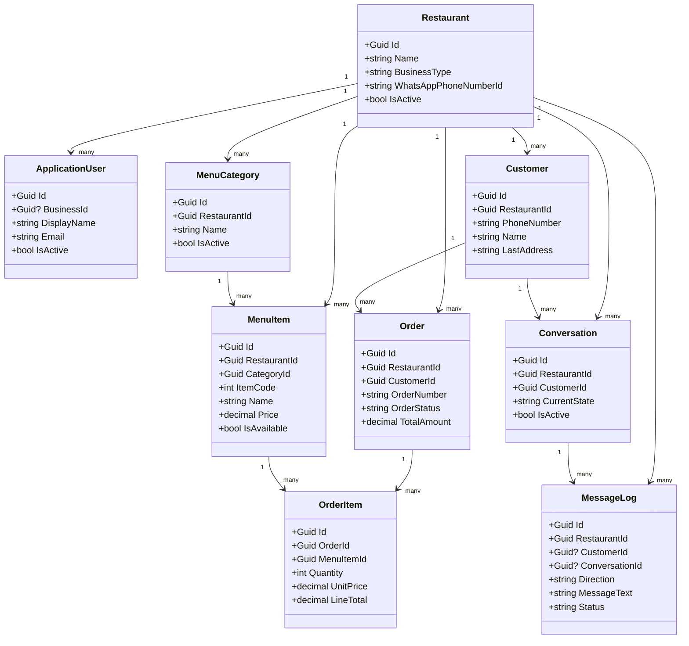

Target API contracts expose Business, Catalog, Category, and Product terminology without renaming the physical tables yet.

---

## 13. Current Database Overview

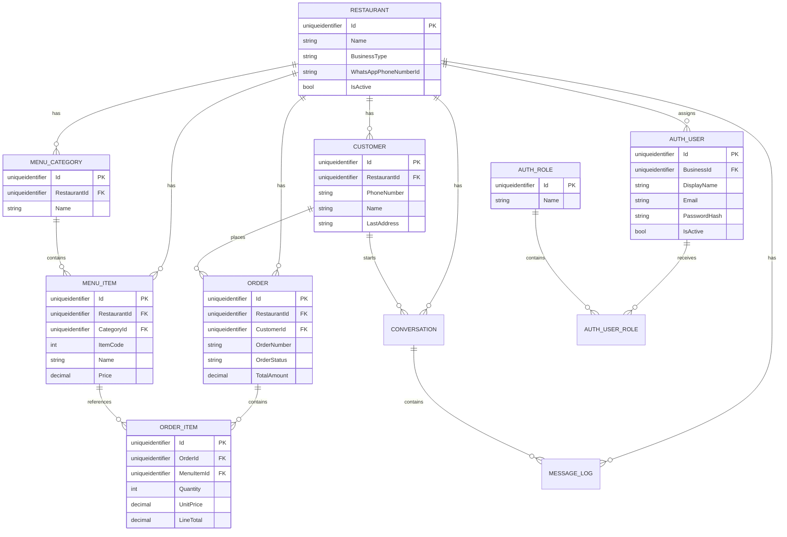

Identity also uses `AuthUserClaim`, `AuthUserLogin`, `AuthRoleClaim`, and `AuthUserToken`.

---

## 14. Data Protection Architecture

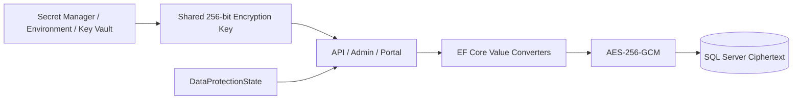

Sensitive non-searchable fields are encrypted with a random nonce and authenticated tag. Existing plaintext rows are rewritten once and recorded in `DataProtectionState`.

The following remain searchable plaintext and require a future HMAC lookup migration:

- `Customer.PhoneNumber`
- `Restaurant.WhatsAppPhoneNumberId`
- Identity email and normalized email

See `docs/Data-Security.md`.

---

## 15. Current Package Diagram

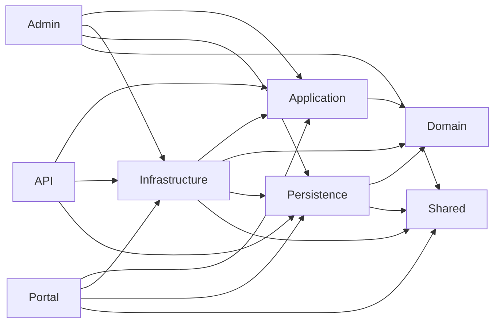

---

## 16. Current Business Owner and Staff Creation

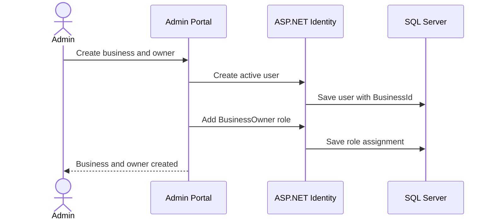

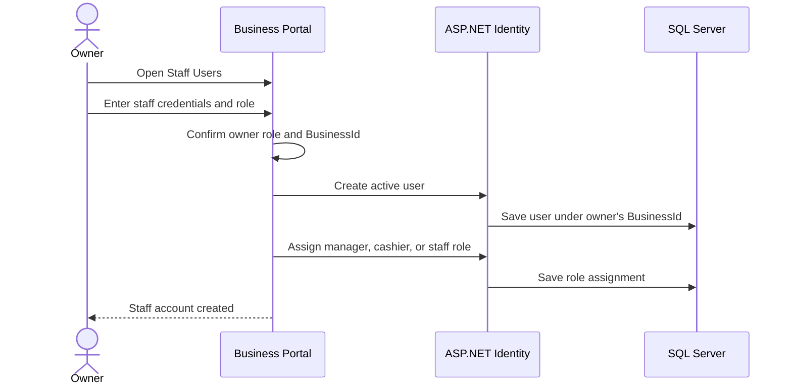

Email invitations and password-reset links are planned. Current provisioning uses a temporary password entered by the administrator or owner.

---

## 17. Planned Target Architecture

The following components are planned and must not be interpreted as implemented:

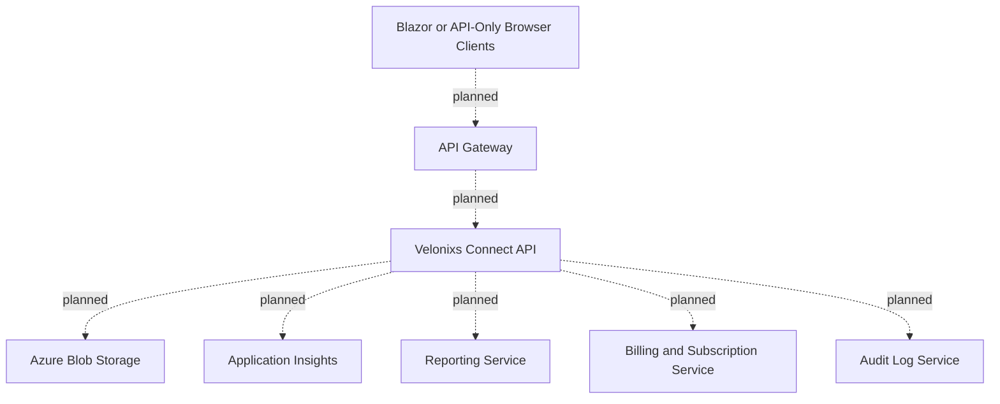

Planned roles may include support, billing, kitchen, and read-only reporting users, but they are not present in `AppRoles` today.

---

## 18. Architecture Backlog

1. Add HMAC lookup columns and encrypt customer phone numbers.
2. Move Admin and Portal toward API-only data access if independent service boundaries are required.
3. Add audit logs for authentication, user management, order changes, and catalog changes.
4. Add customer WhatsApp notifications for order-status transitions.
5. Expand order states to Preparing, Ready, and Delivered.
6. Add password-reset and invitation workflows instead of distributing temporary passwords.
7. Add reporting, billing, subscription, support, Blob Storage, and Application Insights components.
8. Complete the physical rename from Restaurant/MenuItem to Business/Product when compatibility constraints permit.

---

## 19. Related Documentation

```text
docs/
|-- PRD.md
|-- Architecture.md
|-- Architecture-Diagrams.md
|-- Data-Security.md
|-- Database-Design.md
|-- WhatsApp-Integration.md
|-- Deployment-Guide.md
|-- local-setup.md
`-- Roadmap.md
```
