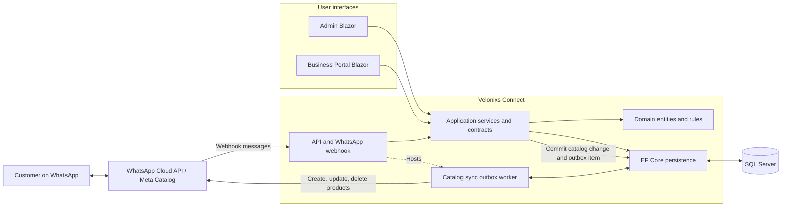

# Velonixs Connect Architecture

## Target Shape



The catalog outbox makes Meta synchronization durable: a menu change is committed to SQL Server first, then processed asynchronously with ordering, retries, leases, and a dry-run option. The API is the only host that runs the database initializer and catalog worker.

## Projects

```text
src/Velonixs.Connect.Api             REST API, WhatsApp webhook, health endpoint
src/Velonixs.Connect.Admin           Platform admin UI
src/Velonixs.Connect.Portal          Staff operations UI
src/Velonixs.Connect.Application     Service contracts and DTOs
src/Velonixs.Connect.Domain          Entities and domain constants
src/Velonixs.Connect.Infrastructure  Messaging, external integrations, application services
src/Velonixs.Connect.Persistence     EF Core, SQL Server, migrations, database initialization
src/Velonixs.Connect.Shared          Shared security roles and claim names
```

## Technology

- ASP.NET Core Web API
- Interactive Server Blazor Web Apps for both the Admin and Portal interfaces, with Bootstrap styling; MVC endpoints remain for sign-in and legacy screens
- SQL Server with Entity Framework Core
- WhatsApp Cloud API
- Azure App Service and Azure SQL for production hosting

## Pending Architecture Work

- Add shared UI/contracts project if needed
- Continue generalizing restaurant-specific domain names into business/catalog terminology

## Business Type Support

The platform now records a business type on the current restaurant/business record. Version 1.0 defaults to `Restaurant`, with planned support for grocery stores, fish markets, bakeries, sweet shops, pharmacies, and retail stores.

## API Compatibility

The API exposes first-class business/catalog endpoints such as `/api/businesses` and `/api/businesses/{id}/catalog` through dedicated application contracts. The original restaurant/menu endpoints remain available for existing local tests and clients while the domain model continues its staged migration.

## Authentication

ASP.NET Identity is the user store for API and browser authentication. API authorization is enabled by default and uses bearer tokens from `/api/auth/login`. Admin and Portal always require cookie authentication.

`PlatformAdmin` users access the Admin Portal without a business assignment. Business Portal users have a required `BusinessId` claim and one of `BusinessOwner`, `BusinessManager`, `Cashier`, or `Staff`. Portal controllers and REST API tenant guards validate that claim before reading or changing business resources. The database stores Identity data in `Auth*` tables.

## Data Protection

Sensitive non-searchable fields are encrypted with AES-256-GCM before persistence. Keys are supplied outside source control and must be shared by API, Admin, and Portal instances. See `docs/Data-Security.md` for encrypted fields, remaining searchable plaintext fields, and production key-management requirements.
