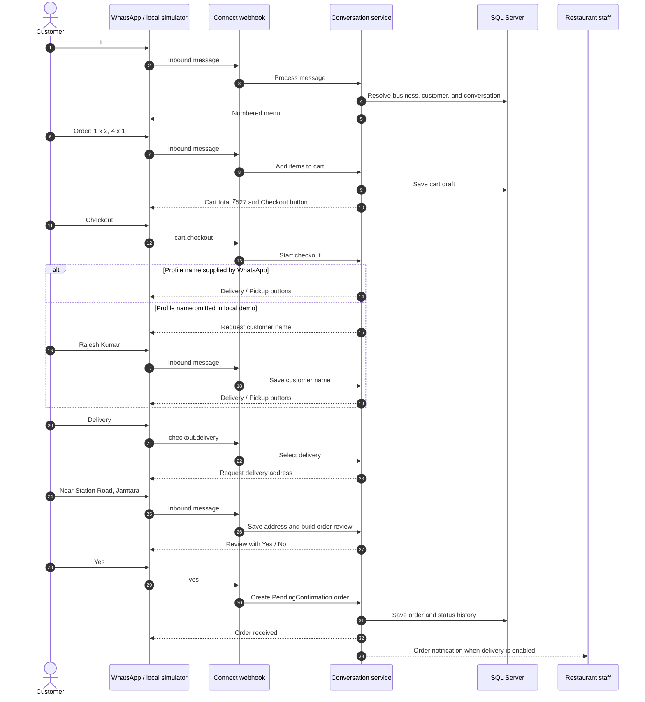

# WhatsApp Messaging Demo Flow

This is a synthetic, repeatable ordering conversation for local demonstrations. It uses the seeded development business and does not require a Meta account or send a real WhatsApp message.

## Demo data

| Field | Dummy value |
| --- | --- |
| Business | 99 Restaurant |
| WhatsApp phone number ID | <code>1196816620181240</code> |
| Customer phone number | <code>+919876543210</code> |
| Customer name | Rajesh Kumar |
| Delivery address | Near Station Road, Jamtara |
| Seed tax | 0% CGST and 0% SGST |

| Item code | Product | Unit price |
| --- | --- | ---: |
| 1 | Margherita Pizza | ₹199 |
| 2 | Paneer Pizza | ₹249 |
| 3 | Veg Burger | ₹99 |
| 4 | Cheese Burger | ₹129 |
| 5 | Paneer Butter Masala | ₹220 |
| 6 | Veg Biryani | ₹180 |

The seeded business intentionally has no Meta catalog ID, retailer IDs, or synchronized product IDs. It therefore demonstrates the numbered-menu fallback. The native WhatsApp catalog route is described at the end of this document.

## Customer conversation



## Expected messages

| Step | Customer input | System result |
| ---: | --- | --- |
| 1 | <code>Hi</code> | Shows the six-item numbered menu and ordering format. |
| 2 | <code>Order: 1 x 2, 4 x 1</code> | Creates a cart with 2 × Margherita Pizza (₹398) and 1 × Cheese Burger (₹129). Subtotal and total are ₹527. |
| 3 | <code>checkout</code> | Shows **Delivery**, **Pickup**, and **Cancel**. If no customer profile name was supplied, it first asks for a name. |
| 4 | <code>checkout.delivery</code> | Requests the delivery address. In the real WhatsApp UI, this is the ID behind the **Delivery** button. |
| 5 | <code>Near Station Road, Jamtara</code> | Shows the final order review and **Yes** / **No** buttons. |
| 6 | <code>yes</code> | Stores a WhatsApp order with status <code>PendingConfirmation</code>, then sends/records the acknowledgement and staff notification. On an empty database, the first order number is <code>VRC-1001</code>. |

If the initial message includes <code>profileName: "Rajesh Kumar"</code>, the checkout already has a customer name and skips the name prompt. If it does not, insert <code>Rajesh Kumar</code> between steps 3 and 4.

## Run the demo locally

1. Run the API in the Development environment with <code>RestaurantConnect:SeedDemoData=true</code>. The default configuration already enables it.
2. Keep <code>WhatsApp:DisableSending=true</code> so no external WhatsApp message is sent.
3. Send the messages above, in order, to the Development-only local simulator:

```http
POST http://localhost:5077/api/webhooks/whatsapp/local-test
Content-Type: application/json

{
  "messageText": "Hi",
  "phoneNumberId": "1196816620181240",
  "fromPhoneNumber": "+919876543210"
}
```

For each following request, change only <code>messageText</code> to the value in the table. The response contains <code>replyText</code>, the conversation IDs, and the next conversation state. A ready-to-run version of the sequence is in [Velonixs.Connect.Api.http](../src/Velonixs.Connect.Api/Velonixs.Connect.Api.http).

## Equivalent Meta webhook payload

Meta sends the production payload to <code>POST /api/webhooks/whatsapp</code>. This example represents the first <code>Hi</code> message:

```json
{
  "object": "whatsapp_business_account",
  "entry": [
    {
      "id": "WABA-DEMO",
      "changes": [
        {
          "field": "messages",
          "value": {
            "messaging_product": "whatsapp",
            "metadata": {
              "display_phone_number": "+91 80555 72840",
              "phone_number_id": "1196816620181240"
            },
            "contacts": [
              {
                "profile": { "name": "Rajesh Kumar" },
                "wa_id": "919876543210"
              }
            ],
            "messages": [
              {
                "from": "919876543210",
                "id": "wamid.demo.001",
                "timestamp": "1780000000",
                "type": "text",
                "text": { "body": "Hi" }
              }
            ]
          }
        }
      ]
    }
  ]
}
```

Production requests must include a valid <code>X-Hub-Signature-256</code> header. The API rejects an unsigned production webhook; Development accepts one only when no app secret has been configured.

## Native catalog-cart variation

When a business has a catalog ID and each eligible product has a retailer ID, Meta product ID, and <code>SyncStatus=Synced</code>, the greeting can send a native product list instead of the numbered menu. A customer cart submitted by WhatsApp looks like this:

```json
{
  "from": "919876543210",
  "id": "wamid.demo.002",
  "type": "order",
  "order": {
    "catalog_id": "CATALOG-DEMO-001",
    "product_items": [
      { "product_retailer_id": "demo-margherita", "quantity": 2 },
      { "product_retailer_id": "demo-cheese-burger", "quantity": "1" }
    ]
  }
}
```

The application validates every submitted retailer ID against an active, in-stock local product in an active category before adding it to the cart. It then continues at the cart-review step above.
