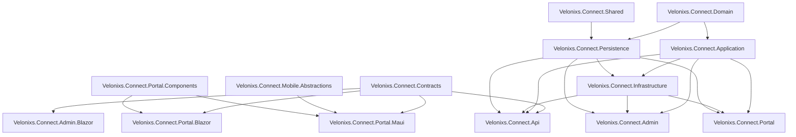

# API-First Migration Plan

Last updated: 2026-06-25

## Current Architecture Assessment

The solution already has several clean-architecture boundaries:

- `Velonixs.Connect.Domain` contains entities and constants without EF Core, ASP.NET Core, Blazor, or MAUI references.
- `Velonixs.Connect.Application` contains service abstractions and DTO records used by API and UI projects.
- `Velonixs.Connect.Infrastructure` implements business services, WhatsApp Cloud API integration, notification sending, and JWT access-token creation.
- `Velonixs.Connect.Persistence` owns EF Core, SQL Server configuration, Identity entities, migrations, encryption, and database initialization.
- `Velonixs.Connect.Api` exposes REST endpoints for auth, businesses/restaurants, menu/catalog, orders, and WhatsApp webhooks.
- `Velonixs.Connect.Admin` and `Velonixs.Connect.Portal` remain MVC/Razor compatibility shells. Their business workflows now go through application services.
- `Velonixs.Connect.Admin.Blazor` and `Velonixs.Connect.Portal.Blazor` are standalone API-backed Blazor WebAssembly shells.
- `Velonixs.Connect.Portal.Components` contains shared Razor UI and browser token storage used by the Blazor shells.
- `Velonixs.Connect.Portal.Maui` is an Android-only MAUI Blazor Hybrid shell backed by the shared API client and mobile abstractions.

The most important current gaps against the target architecture are:

- API routes were unversioned before Phase 1 (`/api/...`), while the target requires `/api/v1/...`.
- There was no dedicated contracts project for shared API shapes.
- Order status-transition rules lived in `Infrastructure`, not `Domain` or `Application`.
- SignalR order notifications are implemented behind authenticated restaurant-scoped groups and consumed by the API-backed Blazor and MAUI shells.
- The current MAUI shell covers login, dashboard, order queue/detail, menu availability, customers, staff, notifications, and restaurant settings.

## Proposed Dependency Diagram

The MVC projects remain temporarily during migration. They should be removed only after equivalent API-backed Blazor features are implemented and tested.

## Migration Risks

- Large namespace/project renames could break EF migrations, Azure deployment, user secrets, and app settings; defer renames until API and UI boundaries are stable.
- Moving UI code away from EF/Identity requires new application services for staff, dashboards, customers, tax settings, and admin catalog workflows.
- Refresh-token persistence needs schema changes and revocation behavior that must be tested before mobile use.
- WhatsApp webhook URLs are externally configured in Meta; keep existing unversioned routes until deployment configuration is updated.
- SignalR must use authenticated restaurant-scoped groups to avoid cross-tenant order disclosure.
- MAUI Android release signing must be documented without committing keystores or passwords.

## Phase Plan

### Phase 1

- Add `Velonixs.Connect.Contracts`.
- Move order status-transition policy into `Domain`.
- Add `/api/v1/...` routes while preserving existing `/api/...` routes.
- Add explicit order confirmation and rejection endpoints.
- Add focused domain tests.
- Keep the existing SQL schema and MVC UIs working.

### Phase 2

- Add application services for dashboard summaries, staff management, customers, restaurant availability, and admin configuration.
- Expose missing API groups: staff, dashboard, restaurant availability, notifications, menu imports, refresh/logout.
- Remove direct EF Core and Identity usage from current UI controllers once equivalent API/application services exist.

### Phase 3

- Create Blazor Admin and Blazor Portal projects.
- Create typed API clients with central auth headers, refresh handling, correlation IDs, timeout, error handling, and retry policy.
- Move reusable restaurant portal UI into `Velonixs.Connect.Portal.Components`.

### Phase 4

- Create `.NET MAUI Blazor Hybrid` Android portal using the shared components and API clients.
- Add platform abstractions for secure token storage, connectivity, local notification, sound, and app lifecycle.
- Add Android App Bundle and signing documentation.

### Phase 5

- Add SignalR real-time order notifications with restaurant-scoped groups.
- Add duplicate-event prevention and reconnection handling.
- Add tests for SignalR tenant isolation and notification behavior.

## Phase 1 Notes

- Existing API routes remain active for compatibility.
- New versioned routes are available under `/api/v1/...`.
- `POST /api/v1/orders/{id}/confirm` accepts estimated minutes and an optional customer-visible comment.
- `POST /api/v1/orders/{id}/reject` requires a reason.
- `PATCH /api/v1/orders/{id}/status` is available in addition to the existing status update route.
- Order status validation now lives in `Velonixs.Connect.Domain.Services.OrderStatusTransitionPolicy`.

## Phase 2 Notes

- Added application service boundaries for restaurant dashboards, customers, and staff.
- Added infrastructure implementations for `IDashboardService`, `ICustomerService`, and `IStaffService`.
- Extended restaurant application operations for tax settings and open/closed availability.
- Extended menu application operations for item lookup, availability updates, and guarded item deletion.
- Added `/api/v1/dashboard/summary`, `/api/v1/customers`, `/api/v1/staff`, `/api/v1/restaurants/{id}/tax-settings`, `/api/v1/restaurants/{id}/availability`, `/api/v1/restaurant-availability/{id}`, and `/api/v1/menu-items/{id}/availability`.
- Migrated `Velonixs.Connect.Portal.Controllers.PortalController` away from direct `RestaurantConnectDbContext` and `UserManager<ApplicationUser>` usage.
- Added `IAdminService` for platform dashboard summaries, restaurant detail summaries, restaurant onboarding with owner creation, owner account creation, and portal-user password reset.
- Migrated `Velonixs.Connect.Admin.Controllers.AdminController` away from direct `RestaurantConnectDbContext` and `UserManager<ApplicationUser>` usage.
- Extended `IMenuService` with master catalog update/delete operations and guarded deletion for in-use master catalog records.
- Added `/api/v1/dashboard/platform`, `/api/v1/restaurants/onboard`, and `/api/v1/master-catalog` endpoints for admin API coverage.
- Added refresh-token persistence with hashed token storage in the new `AuthRefreshToken` table.
- Added `POST /api/v1/auth/refresh` with refresh-token rotation and replay rejection.
- Added `POST /api/v1/auth/logout` with refresh-token revocation.
- Added migration `20260625093000_AddAuthRefreshTokens`.
- Added `.xlsx` menu import support with `POST /api/v1/menu-imports/excel`. The workbook uses the first worksheet and expects `Category`, `ItemCode`, `Name`, `Description`, `Price`, `IsAvailable`, and `IsActive` columns.
- Added `GET /api/v1/notifications` for recent restaurant-scoped notification/message logs.
- Standardized API validation failures and unhandled exception payloads on `ApiErrorResponse`.
- Added data-annotation validation to public request DTOs used by auth, business/restaurant, menu/catalog, staff, customer, and order endpoints.
- Normalized restaurant onboarding and menu-import validation failures to the shared API error contract.
- Added `Velonixs.Connect.Api.IntegrationTests` with HTTP-level validation contract coverage.
- Added `IAccountSessionService` so Admin and Portal login/cookie validation no longer depend directly on Identity from MVC controllers or startup hooks.
- Phase 2 is complete enough to begin Phase 3. Remaining MVC projects stay temporarily as compatibility shells until Blazor replacements are ready.

## Phase 3 Progress Notes

- Added `Velonixs.Connect.Api.Client` as a reusable typed API client library for Blazor and MAUI callers.
- Added DI registration, configurable base address and timeout, bearer-token storage abstraction, in-memory token store, per-request correlation IDs, refresh-token retry on `401`, and `ApiClientException` error parsing from `ApiErrorResponse`.
- Added typed methods for auth, dashboards, restaurants, menus, orders, customers, staff, master catalog, and notifications.
- Added `Velonixs.Connect.Api.Client.Tests` for login token persistence and automatic refresh/retry behavior.
- Added `Velonixs.Connect.Portal.Components` as a shared Razor component library with browser token storage, API error display, loading state, metric tiles, and order status badges.
- Added `Velonixs.Connect.Admin.Blazor` standalone Blazor WebAssembly shell with API-backed login and platform dashboard.
- Added `Velonixs.Connect.Portal.Blazor` standalone Blazor WebAssembly shell with API-backed login and restaurant dashboard.
- Both Blazor shells read `ApiBaseAddress` from `wwwroot/appsettings.json` and use the shared typed API client plus browser-backed token storage.
- Added token-aware layout redirects so protected Blazor pages send unauthenticated users to login.
- Added Admin Blazor restaurant list and onboarding page backed by `/api/v1/restaurants` and `/api/v1/restaurants/onboard`.
- Added Portal Blazor orders page backed by `/api/v1/orders`, `/api/v1/orders/{id}/confirm`, and `/api/v1/orders/{id}/reject`.
- Added Portal Blazor menu page with availability toggles backed by `/api/v1/menu-items/{id}/availability`.
- Added Portal Blazor customers page with inline customer profile edits backed by `/api/v1/customers`.
- Added Admin Blazor master catalog page backed by `/api/v1/master-catalog`.
- Added Portal Blazor staff management page backed by `/api/v1/staff`.
- Added Portal Blazor notifications page backed by `/api/v1/notifications`.
- Added Admin Blazor restaurant detail page backed by restaurant, menu, order, customer, and staff API reads.
- Added Portal Blazor order detail page with line items, status history, and message logs backed by `/api/v1/orders/{id}`.
- Added Portal Blazor restaurant settings page for tax and ordering availability backed by `/api/v1/restaurants/{id}/tax-settings` and `/api/v1/restaurants/{id}/availability`.
- Phase 3 is complete enough to begin Phase 4.

## Phase 4 Progress Notes

- Installed the Android MAUI workload (`maui-android`) for the active .NET 10 SDK and verified MAUI templates are available.
- Installed Microsoft OpenJDK 17 and Android SDK dependencies for command-line Android builds.
- Added `Velonixs.Connect.Mobile.Abstractions` as a buildable MAUI-ready support library without requiring the MAUI workload.
- Added mobile abstractions for secure token storage, connectivity, local notifications, alert sound, and app lifecycle.
- Added `SecureApiTokenStoreAdapter` so the existing typed API client can persist auth state through platform secure storage.
- Added focused tests for secure token storage round-trip, clearing, and corrupt secure-storage state cleanup.
- Scaffolded `Velonixs.Connect.Portal.Maui` as an Android-only `net10.0-android` MAUI Blazor Hybrid project and added it to the solution.
- Wired the MAUI shell to `Velonixs.Connect.Api.Client`, `Velonixs.Connect.Portal.Components`, and `Velonixs.Connect.Mobile.Abstractions`.
- Added MAUI implementations for secure token storage, connectivity, alert sound, Android local notification channel handling, and lifecycle state.
- Added mobile API-backed login, dashboard, and order queue screens with secure auth persistence and offline action guarding.
- Added mobile order detail, menu availability, customer editing, staff management, notifications, and restaurant settings screens.
- Added `docs/maui-android-setup.md` with workload prerequisites, emulator API addressing, command-line SDK/JDK environment variables, signing guidance, and Android verification checklist.
- Added GitHub Actions workflow support for signed Android App Bundle release artifacts.
- The remaining Phase 4 work is emulator/device validation and end-to-end local notification behavior checks on an attached Android device.

## Phase 5 Progress Notes

- Added `IOrderRealtimeNotifier` and `OrderRealtimeEvent` as application-level realtime order event contracts.
- Added a no-op realtime notifier for non-API hosts and a SignalR-backed notifier for `Velonixs.Connect.Api`.
- Added authenticated `OrdersHub` at `/hubs/orders` with restaurant-scoped groups.
- Updated JWT bearer handling to accept SignalR `access_token` query tokens on `/hubs/orders`.
- Published realtime `created` events from WhatsApp order creation and `status_changed` events from order status updates.
- Added deterministic event ids so clients can suppress duplicate order events.
- Added a shared `IOrderRealtimeClient` with automatic reconnect and bounded duplicate-event prevention for Blazor and MAUI clients.
- Wired Portal Blazor dashboard, orders, and order detail pages to refresh from scoped realtime order events.
- Wired Admin Blazor platform dashboard to subscribe to visible restaurants and refresh from scoped realtime order events.
- Added live connection state indicators and route-aware realtime startup/shutdown to both Blazor shell layouts.
- Wired MAUI layout startup/logout route transitions to start and stop the realtime client.
- Wired MAUI order events to local Android notifications and alert feedback.
- Added integration tests for hub authentication and restaurant group scoping.
- Added client tests for duplicate-event suppression.
